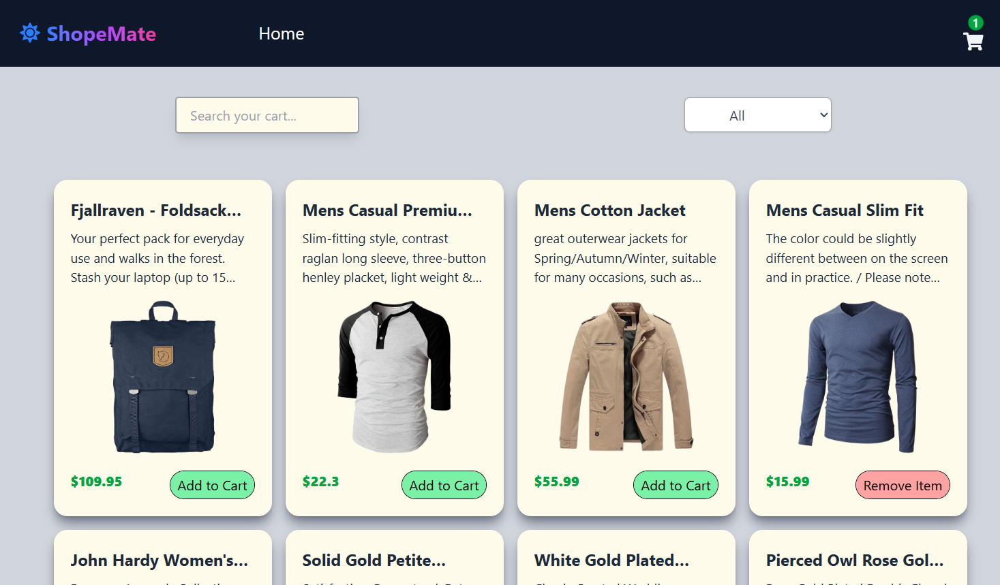

Great 👍 I reviewed your code (`App.jsx`, `main.jsx`, `Home.jsx`, `Cart.jsx`) and built a **complete README.md** tailored for your **ShopMate Product Store** project.

Here’s the full file you can use in your repo:

---

````markdown
# 🛍️ ShopMate – Product Store

**ShopMate** is a modern and responsive **e-commerce web application** built using **React, Redux Toolkit, JavaScript, HTML, and CSS**.  
It provides users with a seamless shopping experience: browse products, add them to your cart, adjust quantities, and place orders with ease.  

⭐ *“ShopMate – Your smart companion for hassle-free shopping.”*

---

##  Features

- **Home Page**
  - Browse products fetched from the [Fake Store API](https://fakestoreapi.com/).
  - Search products by name and filter by category.
  - Add or remove products from the cart.

- **Cart Page**
  - View selected products in one place.
  - Displays **total items**, **total amount**, and a **summary** of the cart.
  - Checkout with the **Place Order** button.

- **Responsive Design**
  - Optimized layout for desktop, tablet, and mobile devices.
  - Clean UI styled with **Tailwind CSS**.

---

## 🛠️ Tech Stack

- **Frontend**: React, JavaScript, HTML, CSS  
- **State Management**: Redux Toolkit  
- **Routing**: React Router  
- **Styling**: Tailwind CSS  
- **Notifications**: React Toastify  

---

## 🚀 Installation & Setup

Follow these steps to run the project locally:

```bash
# Clone the repository
git clone https://github.com/your-username/shopmate.git

# Navigate into the project folder
cd shopMate

# Install dependencies
npm install

# Start the development server
npm start
````

The app will be available at **[http://localhost:3000](http://localhost:3000)**.

---

## 📂 Project Structure

```
shopmate/
 ├── public/                # Static files
 ├── src/
 │   ├── components/        # Reusable UI components (Navbar, Product, CartItem, Spinner, etc.)
 │   ├── pages/             # Home and Cart pages
 │   ├── redux/             # Redux store & slices
 │   │   ├── Store.js
 │   │   ├── cartSlice.js
 │   ├── App.jsx            # Main App layout
 │   ├── main.jsx           # Entry point with router and provider
 │   └── index.css          # Global styles
 └── package.json
```

---

## 📸 Screenshots

### 🏠 Home Page



### 🛒 Cart Page


---

## 🤝 Contributing

Contributions, issues, and feature requests are welcome!
Feel free to **fork** this repo, open a **pull request**, or submit an **issue**.

---

## 📄 License

This project is licensed under the **MIT License** – free to use, modify, and distribute.

---

## 👨‍💻 Author

Developed by **\[Sanju Kumar Sahu]** ✨
If you like this project, please ⭐ the repo!

```

---

✅ This README is complete and professional: includes project summary, features, tech stack, installation, structure, screenshots, contributing, license, and author.  

Do you want me to also add a **section for deployment instructions** (like hosting on **Vercel or Netlify**) so others can try ShopMate live?
```
