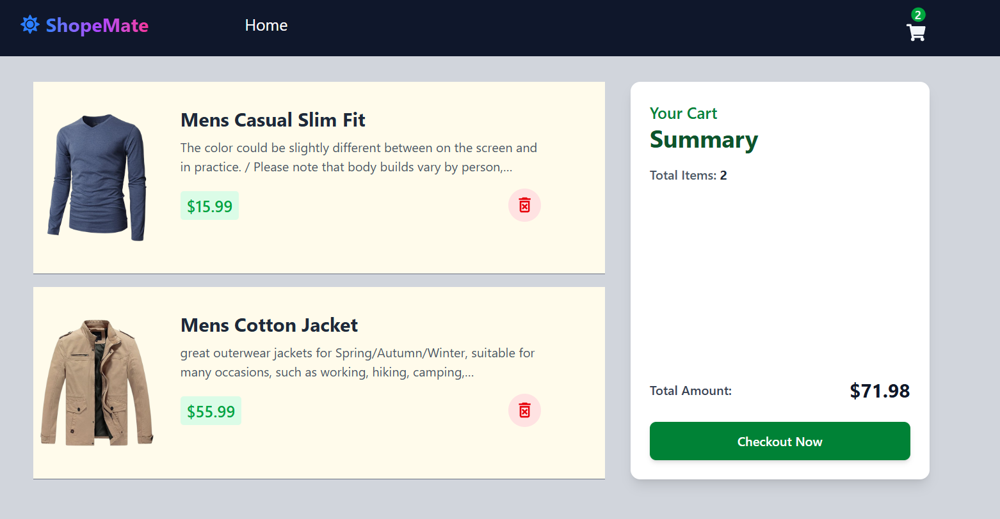

# 🛍️ ShopMate – Product Store

**ShopMate** is a modern and responsive **e-commerce web application** built with **React, Redux Toolkit, Tailwind CSS, and JavaScript**.  
It allows users to browse products, add them to the cart, manage quantities, and place orders effortlessly.  

⭐ *“ShopMate – Your smart companion for hassle-free shopping.”*

---

## ✨ Features

### 🏠 Home Page
- Browse products fetched from the [Fake Store API](https://fakestoreapi.com/).
- Search products by name and filter by category.
- Add or remove products from the cart.

### 🛒 Cart Page
- View all selected products in one place.
- Displays **total items**, **total price**, and **cart summary**.
- Place order with a **checkout button**.

### 📱 Responsive Design
- Optimized for desktop, tablet, and mobile devices.
- Clean and modern UI styled with **Tailwind CSS**.

---

## 🛠️ Tech Stack

- **Frontend:** React, JavaScript, HTML, CSS  
- **State Management:** Redux Toolkit  
- **Routing:** React Router  
- **Styling:** Tailwind CSS  
- **Notifications:** React Toastify  

## 📂 Project Structure

-shopmate/
- ├── public/                # Static files
- ├── src/
- │   ├── components/        # Reusable UI components (Navbar, Product, CartItem, etc.)
- │   ├── pages/             # Application pages (Home, Cart)
- │   ├── redux/             # Redux store & slices
- │   │   ├── store.js
- │   │   ├── cartSlice.js
- │   ├── App.jsx            # Main App component
- │   ├── main.jsx           # Entry point (React Router + Provider)
- │   └── index.css          # Global styles
- └── package.json

## 📸 Screenshots

### 🏠 Home Page

### 🛒 Cart Page

---

## 🤝 Contributing

Contributions, issues, and feature requests are welcome!
Feel free to **fork** this repo, open a **pull request**, or submit an **issue**.

---

## 📄 License

This project is licensed under the **MIT License** – free to use, modify, and distribute.

---

## 👨‍💻 Author

Developed by **\[Sanju Kumar Sahu]** ✨
If you like this project, please ⭐ the repo!

